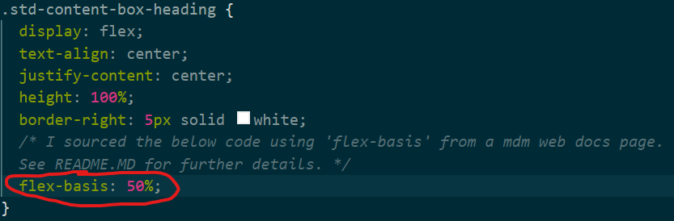
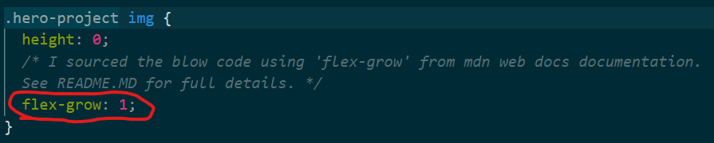

# 2-Challenge-Professional-Portfolio

## Description

This project is a personal portfolio webpage to host information about myself and my web development projects. It serves as the week 2 challenge for The University of Sydney's Coding Bootcamp.

- My motivation to complete this project was to ensure that I would have a live location to contain information about myself and my web development projects.
- Building this project now gives me a way to showcase my work in an interesting way for potential employers and connections to see.
- Previously, my digital footprint was quite minimal, so this project solves the problem of not having work online to be viewed easily.
- Completing this project taught me several design tricks to accommodate text and graphics without breaking the overall layout of the site. Specifically, I learned some new flexbox commands like 'flex-basis' and 'flex-grow' to ensure my content fit in the correct areas - especially when the viewport window size was reduced for smaller screens.

### Screenshots of deployed application at different screen resolutions

#### No media query applied (ideal for standard computer screens):


#### Media query applied when the viewport is less than 1450 px in width (ideal for tablet screens):


#### Media query applied when the viewport is less than 800 px in width (ideal for phone screens):


## Installation

N/A

## Usage

### Usage Method 1: Access the website via GitHub Pages

If you want to simply access the page easily and without hassle, [visit the working GitHub Pages link here](https://isaacfallon.github.io/2-Challenge-Professional-Portfolio/) or by accessing the full link below:

https://isaacfallon.github.io/2-Challenge-Professional-Portfolio/

### Usage Method 2: Clone the project locally

Alternatively, you can clone the repository and run the project locally by following these steps:

1. Ensure Git is installed on your computer and/or download the latest version.
   [View this git install guide if you need help.](https://github.com/git-guides/install-git/)
2. Clone the [repository](https://github.com/isaacfallon/2-Challenge-Professional-Portfolio) by pressing the green 'code' button and select either HTTPS or SSH depending on your preferences.
3. Open your command line of choice and enter the following code:

   ```md
   git clone [HTTPS or SSH key copied here]
   ```

4. Navigate to the cloned folder and access the website by either opening the index.html file in your browser of choice or opening the codebase in your code editor of choice and opening the index.html file in a live window.

## Credits

### Code credits

My codebase uses two CSS flex properties sourced from external locations.

1. The first is the use of 'flex-basis' which can be found on line 119 of my styles.css file:



The purpose of using 'flex-basis' was to ensure that the '.std-content-box-heading' class filled out more space so the subheading could properly fit on one line. While this isn't essential for my code to work, I prefer the way it makes these sections look from a design perspective.

I sourced this idea for using this flex property from an MDN web documentation page linked here:
https://developer.mozilla.org/en-US/docs/Web/CSS/flex-basis

2. The second is the use of 'flex-grow' which can be found on line 184 and 219 of my styles.css file:




The purpose of 'flex-grow' is to expand the image within the parent div container to completely fill the space. By setting the height to '0' in the line above, the 'flex-grow' property then fills the div container completely, even if the viewport size is reduced.

I sourced this code from a Stack Overflow answer linked here:
https://stackoverflow.com/questions/74477930/how-to-build-a-figure-with-a-fixed-height-and-an-img-and-figcaption-that-flex-to

### Images/Graphics sourced

The secondary projects under the 'My Work' section use a placeholder image sourced from Wikipedia:
https://en.m.wikipedia.org/wiki/File:Comingsoon.png

According to the Wikipedia licencing listed:

*"This file is made available under the [Creative Commons](https://en.wikipedia.org/wiki/en:Creative_Commons) [CC0 1.0 Universal Public Domain Dedication.](https://creativecommons.org/publicdomain/zero/1.0/deed.en)*
*The person who associated a work with this deed has dedicated the work to the public domain by waiving all of their rights to the work worldwide under copyright law, including all related and neighbouring rights, to the extent allowed by law. You can copy, modify, distribute and perform the work, even for commercial purposes, all without asking permission."*

## License

MIT License

Copyright (c) 2024 isaacfallon

Permission is hereby granted, free of charge, to any person obtaining a copy
of this software and associated documentation files (the "Software"), to deal
in the Software without restriction, including without limitation the rights
to use, copy, modify, merge, publish, distribute, sublicense, and/or sell
copies of the Software, and to permit persons to whom the Software is
furnished to do so, subject to the following conditions:

The above copyright notice and this permission notice shall be included in all
copies or substantial portions of the Software.

THE SOFTWARE IS PROVIDED "AS IS", WITHOUT WARRANTY OF ANY KIND, EXPRESS OR
IMPLIED, INCLUDING BUT NOT LIMITED TO THE WARRANTIES OF MERCHANTABILITY,
FITNESS FOR A PARTICULAR PURPOSE AND NONINFRINGEMENT. IN NO EVENT SHALL THE
AUTHORS OR COPYRIGHT HOLDERS BE LIABLE FOR ANY CLAIM, DAMAGES OR OTHER
LIABILITY, WHETHER IN AN ACTION OF CONTRACT, TORT OR OTHERWISE, ARISING FROM,
OUT OF OR IN CONNECTION WITH THE SOFTWARE OR THE USE OR OTHER DEALINGS IN THE
SOFTWARE.
